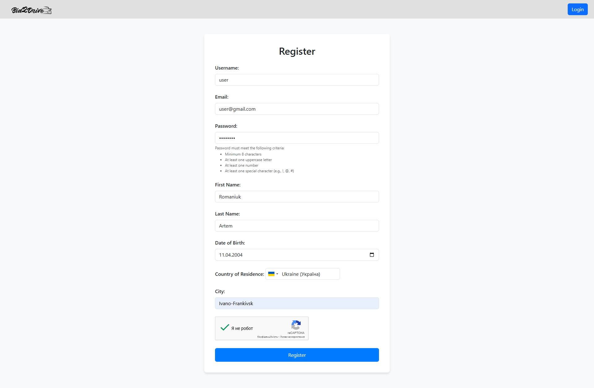

# Bid2DriveSpring

Bid2Drive is a comprehensive online car auction platform supporting multiple auction types, secure user interaction, and real-time bidding. Users can participate in **Standard**, **Live Bid**, or **Used Car Sales**, track auction statuses, and communicate via a built-in messaging system.

**Based on [SecureLoginSystemSpring](https://github.com/jabka1/SecureLoginSystemSpring), ensuring a robust and secure login & registration system**

## Deployment

The platform is currently deployed and running on **Heroku**. Access it directly:

link here

## Features
### User Account Features
- Account registration, login, email verification
- Change password and username
- Two-Factor Authentication (2FA)
- Password reset via email
- Google OAuth2 login
- Account lockout after failed attempts
- Profile photo upload
- User roles & admin panel

### Auction Types
- **Standard Auction**: fixed end time
- **Live Bid**: scheduled start/end
- **Used Car Sale**: instant offer-based listing
- Separate display logic per type
- Filtering and pagination by brand, country, price, etc.
- Timezone-adjusted auction times
- Auction verification

### Auction Details & Actions
- Full car specs, condition, emissions, seller info
- Verification process with admin decision UI
- HTML emails on approval/rejection
- PDF generation on auction win (supports Cyrillic)

### Bidding & Winning
- Real-time bidding
- Bid history and filtering by auction type
- Winners auto-assigned post-auction
- Email with attached certificate PDF

### Messaging System
- Private chat between users
- Supports text & image messages (AWS S3)
- Read receipts

### Reviews & Reports
- Leave/view reviews on auctions and users
- Admin dashboard to process reports
- Auction/user blocking or warnings with email dispatch

### Saved Auctions
- Users can save/unsave auctions
- Auto-remove on finalization or blocking

<br>

## Prerequisites
- Java 17+
- Maven
- MySQL 8+
- AWS account with S3 & IAM
- Google reCAPTCHA & OAuth2 keys
- SMTP credentials (Mailtrap or other)

<br>

## Technologies Used
- Spring Boot, Spring Security, Spring Data JPA
- Thymeleaf, Bootstrap 5, JavaScript
- Hibernate ORM, MySQL
- JavaMailSender
- Google reCAPTCHA & OAuth2
- AWS S3
- Apache PDFBox
- WebSocket (STOMP + SockJS)
- Heroku

<br>

## Installation

### 1. Clone the repository
```bash
git clone https://github.com/jabka1/Bid2DriveSpring
cd Bid2DriveSpring
```

### 2. Rename application.txt → application.properties and configure:
```properties
spring.application.name=Bid2Drive

spring.datasource.url=jdbc:mysql://localhost:3306/YOUR_DB
spring.datasource.driver-class-name=com.mysql.cj.jdbc.Driver
spring.datasource.username=YOUR_USERNAME
spring.datasource.password=YOUR_PASSWORD

spring.jpa.database-platform=org.hibernate.dialect.MySQL8Dialect
spring.jpa.hibernate.ddl-auto=update
spring.jpa.show-sql=true

google.recaptcha.site.key=YOUR_SITE_KEY
google.recaptcha.secret.key=YOUR_SECRET_KEY

spring.mail.host=smtp.YOUR_EMAIL_PROVIDER.com
spring.mail.port=587
spring.mail.username=YOUR_EMAIL
spring.mail.password=YOUR_EMAIL_PASSWORD
spring.mail.properties.mail.smtp.auth=true
spring.mail.properties.mail.smtp.starttls.enable=true

logging.level.team.bid2drivespring=DEBUG

spring.security.oauth2.client.registration.google.client-id=YOUR_CLIENT_ID
spring.security.oauth2.client.registration.google.client-secret=YOUR_CLIENT_SECRET
spring.security.oauth2.client.registration.google.scope=profile,email
spring.security.oauth2.client.registration.google.redirect-uri={baseUrl}/login/oauth2/code/google
spring.security.oauth2.client.registration.google.client-name=Google
spring.security.oauth2.client.provider.google.authorization-uri=https://accounts.google.com/o/oauth2/v2/auth
spring.security.oauth2.client.provider.google.token-uri=https://oauth2.googleapis.com/token
spring.security.oauth2.client.provider.google.user-info-uri=https://www.googleapis.com/oauth2/v3/userinfo

cloud.aws.credentials.access-key=YOUR_ACCESS_KEY
cloud.aws.credentials.secret-key=YOUR_SECRET_KEY
cloud.aws.region.static=YOUR_REGION
cloud.aws.s3.bucket=YOUR_BUCKET_NAME

admin.secret.key=YOUR_SECRET_KEY

spring.servlet.multipart.max-file-size=150MB
spring.servlet.multipart.max-request-size=150MB

encryption.key=YOUR_KEY

app.domain=http://localhost:8080

```

### 3. Build and Run
```bash
mvn clean install
mvn spring-boot:run
```

Visit: http://localhost:8080

<br>

## Screenshots

### Auctions

- **Create Auction**
  

- **My Auctions (from owner)**
  

- **My Bids (from another user)**
  

- **Auction View (from owner)**
  

- **Won Auctions (from another user)**
  

- **Saved Auctions (from another user)**
  

- **Auction Details (from another user)**
  

- **Email after winning**
  

- **Auction Sheet**
  -1.png)

### Main Auction Pages

- **Home**
  

- **Livebid**
  

- **Standard**
  

- **Used Car Sale**
  

### Chat System

- **Chat List (from owner)**
  

- **Chat Room (from another user)**
  

### Profile & Authentication

- **Login**
  

- **Register**
  

- **Profile**
  

- **Change Profile Info**
  

- **Upload Passport**
  

- **User Profile View**
  

- **Error Example**
  


### Admin Panel (Reports & Verification)

- **Verify Car**
  

- **Pending User Verifications**
  

- **User Reports**
  

- **User Report Detail**
  

- **Report User Form**
  
